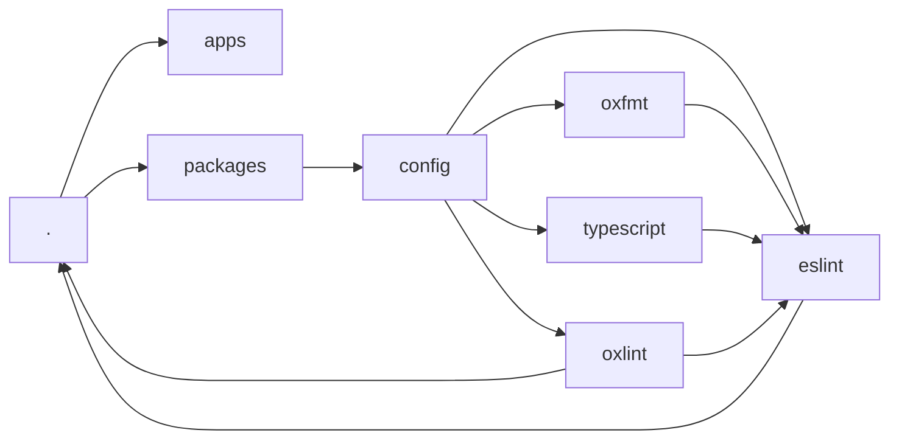

<div align="center">
  <h1><b>Ställning</b></h1>
  <span><i>[ˈstɛlː.nɪŋ]</i>: meaning "scaffold" in swedish</span>

  
</div>

## About the Project

This boilerplate serves as a foundation for building future projects. Feel free to utilize it for your own needs.

## Features

- **Monorepo Architecture**: Organized with PNPM workspaces and accelerated with Turborepo.
- **Multiple Templates**: Choose from a minimal setup or a full-fledged Nuxt application.
- **Code Quality**: Comes with ESLint, Oxlint, oxfmt, and commit linting configured out-of-the-box.
- **Automation**: Husky for pre-commit hooks and Changesets for automated versioning and changelogs.
- **Modern Tech**: Built with TypeScript, Nuxt, and other modern technologies.

## Monorepo Structure

```sh
.
├── apps
└── packages/
    └── config/
        ├── eslint
        ├── oxlint
        └── typescript
```



## Templates

A variety of templates are available, ranging from minimal (main branch) to technology-focused. Explore each branch to find the one that best suits your needs.

### Available Templates

- [minimal](https://github.com/Sioood/stallning/tree/minimal)
  - Minimal template configuration to get started with the essentials for any new project.
    - [Typescript](https://www.typescriptlang.org/)
    - [ESLint](https://eslint.org/)
    - [Oxlint](https://oxc.rs/docs/guide/usage/linter)
    - [oxfmt](https://oxc.rs/docs/guide/usage/formatter)
    - [Husky](https://github.com/typicode/husky), [lint-staged](https://github.com/okonet/lint-staged) and [commitlint](https://github.com/conventional-changelog/commitlint)
    - [Changeset](https://github.com/changesets/changeset)

- [nuxt](https://github.com/Sioood/stallning/tree/nuxt)
  - Full-fledged Nuxt application with a rich feature set.
    - [Nuxt](https://nuxt.com/) (Vue framework)
    - [Tailwind CSS](https://tailwindcss.com/) for styling
    - [@ark-ui/vue](https://ark.ecosyste.ms/packages/@ark-ui/vue) for accessible UI components
    - [Pinia](https://pinia.vuejs.org/) for state management
    - [@nuxtjs/i18n](https://i18n.nuxt.dev/) for internationalization (en-US, fr-FR)
    - [@nuxtjs/seo](https://seo.nuxt.dev/) for SEO optimization
    - [VueUse](https://vueuse.org/) for composable utilities
    - [@nuxt/image](https://image.nuxt.com/), [@nuxt/icon](https://github.com/nuxt-modules/icon), [@nuxt/fonts](https://fonts.nuxt.com/)
    - [v-gsap-nuxt](https://github.com/davidcariss/v-gsap-nuxt) for animations
    - [Compodium](https://compodium.dev/) for component documentation
    - [nuxt-security](https://nuxt-security.vercel.app/) for security headers

## 🚧 Evolution

This boilerplate is intended to constantly evolve. So if you have any feedback or suggestions, please don't hesitate to reach out, or open an issue.

## 🚀 Get started

### Minimal prerequisites (Check package.json)

1. [**node**](https://nodejs.org/en/download) >=25.0.0
2. [**pnpm**](https://pnpm.io/installation) pnpm@10.33.0

```sh
npm install -g pnpm
```

After pnpm installation, install dependencies to run the init script:

```sh
pnpm install
```

3. [**git**](https://git-scm.com/download)

### Initialize the project

If you cloned this boilerplate to start a new project, run the init script once to customize it:

```sh
# Preview changes without applying them
pnpm init --dry-run

# Interactive mode - answer prompts to customize
pnpm init

# Non-interactive mode - provide all options via CLI
pnpm init -y --name my-project --description "My project"
```

The init script will:

- Replace "stallning" with your project name across all files and directories
- Optionally reset git history for a fresh start
- Optionally add the upstream remote for future syncs

Use `--dry-run` to preview what changes would be made without actually modifying any files.

After running the init script, install dependencies again and you're ready to go.

```sh
pnpm install
```

### 📦 Recommended extensions

You can install the recommended extensions defined in the `./.vscode/.code-workspace` file.

Go to [VSCode](https://code.visualstudio.com/) and open the extension tab, search for the recommended extensions by typing `@recommended` and install them.

### Commit Message Convention

This repository follows the [Conventional Commits](https://www.conventionalcommits.org/en/v1.0.0/) specification. Please make sure your commit messages adhere to this format.

The available scopes are: `global`, `config`.
The available types are: `build`, `chore`, `ci`, `docs`, `feat`, `fix`, `perf`, `refactor`, `revert`, `style`, and `test`.

## Open workspace

Open the workspace file at `./.vscode/.code-workspace` to get started.

## Available Scripts

The following scripts are available at the root of the monorepo:

| Script                   | Description                                                  |
| ------------------------ | ------------------------------------------------------------ |
| `pnpm lint`              | Run all linting checks.                                      |
| `pnpm lint:oxlint`       | Run oxlint checks.                                           |
| `pnpm lint:eslint`       | Run ESLint checks.                                           |
| `pnpm check-types`       | Run all TypeScript checks.                                   |
| `pnpm format`            | Format the codebase with oxfmt.                              |
| `pnpm format:check`      | Verify formatting with oxfmt.                                |
| `pnpm init`              | Initialize the project with your custom name (used once)     |
| `pnpm sync:merge`        | Merge one remote branch into a target branch.                |
| `pnpm sync:pick`         | Cherry-pick commit(s) from remote branch into target branch. |
| `pnpm knip`              | Detect unused files, exports, and dependencies.              |
| `pnpm knip:fix`          | Run Knip with autofix for fixable issues.                    |
| `pnpm todoctor`          | Run todoctor to check technical debt                         |
| `pnpm changeset`         | Create a new changeset for versioning.                       |
| `pnpm changeset:release` | Create a release tag from changesets.                        |
| `pnpm build`             | Build all packages and applications.                         |

## Git Workflow

The recommended workflow for this repository is to use [Git Flow](https://www.atlassian.com/git/tutorials/comparing-workflows/gitflow-workflow).

Combined with changesets for versioning, this workflow allows you to keep track of changes and releases in a structured and efficient way. It automatically creates release tags and generates changelogs when a PR is merged to main and contains changesets.

## Branch Sync Workflow

This repository uses a hybrid sync strategy to keep template branches aligned with the foundation:

- **Baseline sync**: merge shared boilerplate updates from `minimal` regularly
- **Selective sync**: cherry-pick specific commits when only some templates need changes

See [`docs/branch-sync.md`](docs/branch-sync.md) for fork setup, sync commands, validation steps, conflict handling, and recovery flows.
